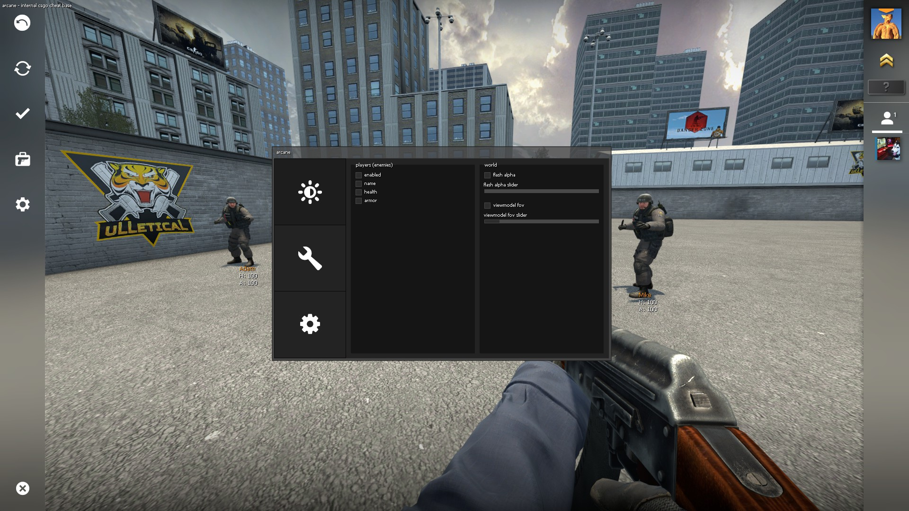

# arcane      

***

***

&nbsp;

This menu was made using the FGUI framework. You can read the wiki [here](https://github.com/iFloody/fgui/wiki).

You must also download <a href="https://github.com/solitude70/arcane-csgo/blob/master/resources/icon_font.ttf">this font</a> for the tab logos.

&nbsp;

**Hooked functions**
- Frame stage notify
- Create move
- Override view
- Scene end
- Emit sound
- Paint traverse

&nbsp;

**Features**
- Ability to save/load configs
- Netvar manager
- Show enemy player name
- Show enemy player health
- Show enemy player armor value
- Flash alpha modifier
- Viewmodel fov modifier
- Auto bunny hop
- Rank revealer
- Grenade preview
- Disconnect to lobby button
- Watermark